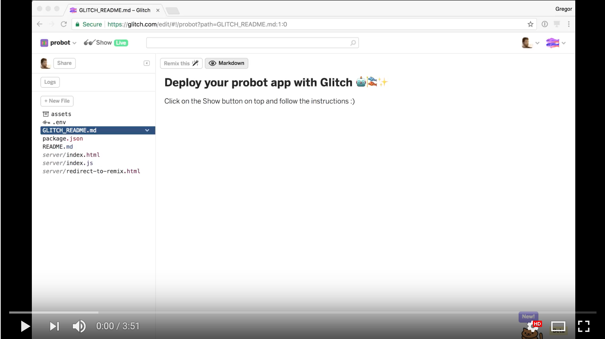

# glitch-github-app

> Deploy Probot apps using a web-based setup form

Creating a new GitHub App is free and easy. And there is a [growing list of really
cool bots built with Probot](https://probot.github.io/apps/) ready for you to
deploy. With `glitch-github-app`, you can deploy own instances for all of them
directly to [Glitch](https://glitch.com/), without writing a single line of code
or ever touching your terminal.

Get started at [probot.glitch.me](https://probot.glitch.me) 🤖🎏✨

## How it works

[Glitch](https://glitch.com/), compared to over deployment services like [now](https://zeit.co/now)
or [Heroku](https://heroku.com), allows you to write to the file system of your
application. `glitch-github-app` takes advantage of that and simply overrides
itself :)

When you submit the form, it uploads your `*private-key.pem` to `.data/private-key.pem`
where only you can and the app can access it. It also writes the configuration
like your Webhook Secret and the app id into the `.env` file, which is also only
accessible to you.

Once the form is submitted, your GitHub App is ready to go!

## About

Hey I’m Gregor, I love building bots to automate workflows on GitHub.
You can [follow me twitter](https://twitter.com/gr2m).

## License

[Apache 2.0](LICENSE)
